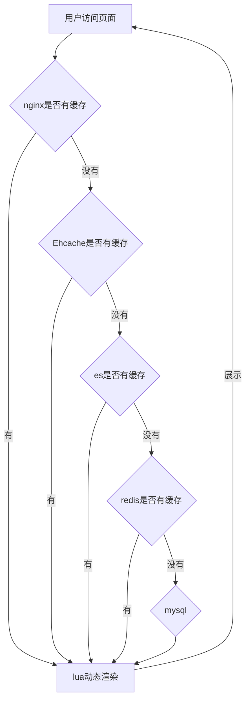

<h1  style="text-align: center">shop.main 项目 小结</h1

​																											`微服6班 徐立`

### 技术 解剖

### 1.环境

+ [x] jdk 1.8
+ [x] maven 
+ [ ] gradle
+ [x] idea
+ [x] tomcat9 (SpringBoot 2.1.6)
+ [x] redis5.0

### 2.技术

#### 注册中心

* [x] eureka(AP)
* [ ] consul(CP)
* [ ] zookeeper(CP)
* [ ] nacos(AP)

#### 配置中心

* [ ] spring-config
* [ ] 携程-Apollo

#### 服务熔断与监控

+ [ ] hystrix
+ [ ] dashboard
+ [ ] turbine
+ [ ] sentinel

#### 负载均衡

* [x] ribbon

#### 服务调用

* [x] fegin
* [x] rabbitmq

#### 网关

* [x] gateway
* [ ] zuul

#### 服务安全

* [x] spring security +jwt +oauth2(密码模式) +非对称加密
* [ ] shiro

#### 链路追踪

* [x] Sleuth +zipkin (可视化)

#### 全文搜素引擎

* [ ] solr
* [x] elasticsearch

#### 分布式日志

+ [ ] elasticsearch+logstash+kibana+MQ

#### 页面静态化

##### 1.模板引擎

* [x] thymleaf
* [ ] freemarker

##### 2.反向代理服务器

* [x] openrestry(lua+nginx)

#### 数据同步

* [x] canal

#### 支付集成

* [x] 微信支付
* [ ] 支付宝支付

#### 消息队列

* [x] rabbitmq
* [ ] rockitmq
* [ ] activemq
* [ ] kafka

#### 分布式事务

* [x] seata
  * [x] AT模式(2PC)
  * [ ] tcc模式
* [x] 本地消息表（rabbitmq）

#### 前后端沟通

* [x] swagger2
* [x] postman

## 一、项目搭建

​	使用 springboot + maven 进行 项目框架的搭建

### 1.SpringBoot

#### 为什么使用:

>SpringBoot 是 基于 Spring FrameWork 进行构建  并通过 自动化配置进行 配置的简化 是一个maven项目
>
>以及 用yaml 和 properties 文件 代替了 xml配置  内置一个 web容器(Tomcat或Jetty等)
>
>用来简化新 Spring 应用的初始搭建以及开发过程。
>
>从最根本上来讲，Spring Boot 就是一些库的集合，它能够被任意项目的构建系统所使用。它使用 “习惯优于配置” （项目中存在大量的配置，此外还内置一个习惯性的配置）的理念让你的项目快速运行起来。用大佬的话来理解，就是 spring boot 其实不是什么新的框架，它默认配置了很多框架的使用方式，就像 maven 整合了所有的 jar 包，spring boot 整合了所有的框架

1. 为所有 Spring 开发提供一个更快更广泛的入门体验。
2. 零配置。无冗余代码生成和XML 强制配置，遵循“约定大于配置” 。
3. 集成了大量常用的第三方库的配置， Spring Boot 应用为这些第三方库提供了几乎可以零配置的开箱即用的能力。
4. 提供一系列大型项目常用的非功能性特征，如嵌入式服务器、安全性、度量、运行状况检查、外部化配置等。
5. Spring Boot 不是Spring 的替代者，Spring 框架是通过 IOC 机制来管理 Bean 的。Spring Boot 依赖 Spring 框架来管理对象的依赖。Spring Boot 并不是Spring 的精简版本，而是为使用 Spring 做好各种产品级准备

#### 如何集成:

1.通过 File->new Project ->Spring Initializr （本质上是通过 https://start.spring.io）进行构建的


2.通过 创建 maven 项目来构建

```xml
	<!--pom.xml 里继承 spring-boot-starter-parent-->
	<parent>
        <groupId>org.springframework.boot</groupId>
        <artifactId>spring-boot-starter-parent</artifactId>
        <version>2.1.6.RELEASE</version>
    </parent>
	 <properties>
        <project.build.sourceEncoding>UTF-8</project.build.sourceEncoding>
        <project.reporting.outputEncoding>UTF-8</project.reporting.outputEncoding>
        <java.version>1.8</java.version>
    </properties>
<dependencies>
	<!-- 加入各种 spring-boot-starter 或依赖 -->     
</dependencies>
```

使用 Spring Security +oauth2+ jwt进行 spring安全框架搭建

### 2.SpringCloud

##### SpringBoot和SpringCloud的区别

SpringBoot专注于快速方便的**开发单个个体微服务**。

SpringCloud是关注全局的微服务协调整理治理框架，它将SpringBoot开发的一个个单体微服务整合并管理起来，

为各个微服务之间提供，配置管理、服务发现、断路器、路由、微代理、事件总线、全局锁、决策竞选、分布式会话等等集成服务

SpringBoot可以离开SpringCloud独立使用开发项目，但是 **SpringCloud离不开SpringBoot**，属于依赖的关系.

SpringBoot专注于**快速、方便的开发单个微服务个体**，SpringCloud关注**全局的服务治理框架**。

# 二、项目架构


##	一、微服务注册中心

#### 为什么要使用注册中心

>注册中心可以说是微服务架构中的**通讯录**，它记录了服务和服务地址的映射关系在分布式架构中， 
>
>服务会注册到这里，当服务需要调用其它服务时，就这里找到服务的地址，进行调用。
>
>服务注册中心（下称注册中心）是微服务架构非常重要的一个组件，在微服务架构里主要起到了协调者的一个作用。注册中心一般包含如下几个功能：
>
>1. 服务发现： 
>
>服务注册/反注册：保存服务提供者和服务调用者的信息 
>
>服务订阅/取消订阅：服务调用者订阅服务提供者的信息，最好有实时推送的功能 
>
>服务路由（可选）：具有筛选整合服务提供者的能力。
>
>2. 服务配置： 
>
>配置订阅：服务提供者和服务调用者订阅微服务相关的配置
>
>配置下发：主动将配置推送给服务提供者和服务调用者
>
>3. 服务健康检测 
>
>检测服务提供者的健康情况
>
>CAP [一致性](https://baike.baidu.com/item/一致性/9840083)（Consistency）、[可用性](https://baike.baidu.com/item/可用性/109628)（Availability）、分区容错性（Partition tolerance）


###	1、 Netflix Eureka

`servlet 程序`

####	(1).依赖

```xml
<!--父pom 加入SpringCloud 依赖-->
<dependencyManagement>
    <dependencies>
        <dependency>
            <groupId>org.springframework.cloud</groupId>
            <artifactId>spring-cloud-dependencies</artifactId>
            <version>Greenwich.RELEASE</version>
            <type>pom</type>
            <scope>import</scope>
        </dependency>
    </dependencies>
</dependencyManagement>
<repositories>
    <repository>
        <id>spring-milestones</id>
        <name>Spring Milestones</name>
        <url>https://repo.spring.io/milestone</url>
        <snapshots>
            <enabled>false</enabled>
        </snapshots>
    </repository>
</repositories>

<!--Eureka 服务端 依赖-->
		<dependency>
            <groupId>org.springframework.cloud</groupId>
            <artifactId>spring-cloud-starter-netflix-eureka-server</artifactId>
        </dependency>
<!--Eureka 客户端 依赖-->
		<dependency>
            <groupId>org.springframework.cloud</groupId>
            <artifactId>spring-cloud-starter-netflix-eureka-client</artifactId>
        </dependency>
```

####		(2) yml配置

```yml
server:
 port: 端口号
spring:
 application:
  name: 服务名
  #服务端
 security:
  user:
  	name: 用户名
  	password: 密码
eureka:
 client:
  service-url:
   defaultZone: 注册到的地址
  #不提取注册表
  fetch-register: false
  #不注册到自身
  register-with-eureka: false
 server:
   enable-self-preservation: false #禁用自我保护功能
   eviction-interval-timer-in-ms: 4000 #剔除时间
  #客户端
eureka:
 client:
  service-url:
   defaultZone: 注册到的地址
 instance:
   instance-id: 实例-id
   prefer-ip-adress: true #使用ip地址注册
   lease-renewal-interval-in-second:  #租约续约间隔（以秒为单位）
   lease-expiration-duration-in-senconds:  #合约过期时间（以秒为单位）
```

#### (3) 启动类注解

``` java
//服务端
@SpringBootApplication
@EnableEurekaServer
@EnableWebSecurity 
//1: 加载了WebSecurityConfiguration配置类, 配置安全认证策略。
//2: 加载了AuthenticationConfiguration, 配置了认证信息。
public class MyEureka {
    public static void main(String[] args) {
        SpringApplication.run(MyEureka.class,args);
    }
     @Override
    protected void configure(HttpSecurity http) throws Exception {
        http.csrf().disable();//关闭csrf检查
        super.configure(http);
    }
}
//客户端
@SpringBootApplication
@EnableEurekaClient //或者EnableDiscoveryClient
public class MyOrder {
    public static void main(String[] args) {
        SpringApplication.run(MyOrder.class,args);
    }
}
```

## 二、微服务网关

### 为什么要使用网关

>
>
>`当使用分布式架构 搭建了多个微服务模块后问题就产生了`
>
>每个微服务都有它们自己的ip和端口 客户端 来进行 访问这些微服务时必须记住几十甚至几百个地址，
>
>这对于客户端方来说太复杂也难以 维护如果让客户端直接与各个微服务通讯，可能会有很多问题：
>
>
>
>​	客户端会请求多个不同的服务，需要维护不同的请求地址，增加开发难度 
>
>在某些场景下存在跨域请求的问题  加大身份认证的难度，每个微服务需要独立认证 
>
>
>
>​	因此，我们需要一个微服务网关，介于客户端与服务器之间的中间层，所有的外部请求都会先经过微服务网关。客户端只需要与网关交互，只知道一个网关地址即可，这样简化了开发还有以下优点：
>
>1. 易于监控 
>
>2. 易于认证 
>3. 减少了客户端与各个微服务之间的交互次数
>
>
>
>
>
>**什么是微服务网关**
>
>API网关是一个服务器，是系统对外的唯一入口。API网关封装了系统内部架构，为每个客户端提供一个定制的API。API网关方式的核心要点是，所有的客户端和消费端都通过统一的网关接入微服务，在网关层处理所有的非业务功能。通常，网关也是提供REST/HTTP的访问API。服务端通过API-GW注册和管理服务。 
>
>**作用和应用场景**
>
>网关具有的职责，如身份验证、监控、负载均衡、缓存、请求分片与管理、静态响应处理。当然，最主要的职责还是与“外界联系”。

### 1.GateWay 

>​	Spring Cloud Gateway 是 Spring 官方基于 **Spring 5.0，Spring Boot 2.0 和 Project Reactor** 等技术开的网关，旨在为微服务架构提供一种简单而有效的统一的 API 路由管理方式，统一访问接口。SpringCloud Gateway 作为 Spring Cloud 生态系中的网关，目标是替代 Netflflix ZUUL，其不仅提供统一的路由方式，并且基于 **Filter 链**的方式提供了网关基本的功能，例如：**安全，监控/埋点，和限流等**。它是基于**Netty的响应式开发模式**。

##### (1)依赖

```xml
<!--启动时和spring-boot-startet-web有冲突-->
<dependency>
    <groupId>org.springframework.cloud</groupId>
    <artifactId>spring-cloud-starter-gateway</artifactId>
</dependency>
```


##### (2)yml配置

```yml
server:
  port: 7002
spring:
  application:
    name: gateway-server
  cloud:
    gateway:
      globalcors:
        corsConfigurations:
          '[/**]': # 匹配所有请求
            allowedOrigins: "*" #跨域处理 允许所有的域
            allowedMethods: "*"# 支持的方法
            allowedHeaders: "*"
      routes:
      - id: user-server
        uri: lb://user-server
        predicates:
          - Path=/api/user/**
      - id: order-server
        uri: lb://order-server
        predicates:
          - Path=/api/order/**
      - id: swagger-user-server
        uri: lb://user-server
        predicates:
          - Path=/swagger-user-server/**
        filters:
        - RewritePath=/swagger-user-server/(?<segment>.*), /$\{segment}
      - id: swagger-order-server
        uri: lb://order-server
        predicates:
          - Path=/swagger-order-server/**
        filters:
        - RewritePath=/swagger-order-server/(?<segment>.*), /$\{segment}
  redis:
    host: 127.0.0.1
    port: 6379
    database: 0
  main:
    allow-bean-definition-overriding: true
logging:
  level:
    root: INFO
eureka:
  client:
    service-url:
      defaultZone: http://localhost:7001/eureka/
  instance:
    instance-id: ${spring.cloud.client.ip-address}:${server.port}
    prefer-ip-address: true
    lease-expiration-duration-in-seconds: 10
    lease-renewal-interval-in-seconds: 4
#向外暴露gateway 监控端点
management:
  endpoints:
    web:
      exposure:
        include: gateway
       
```

 [gateway 监控端点拓展](https://www.jianshu.com/p/1bafaf40bfb7);

[gateway 整合swagger2 文档](https://blog.csdn.net/qq_31748587/article/details/102563155)

##### (3)启动类注解

```java
@SpringBootApplication 
public class MyGateway { 
    public static void main(String[] args) { 
        SpringApplication.run(MyGateway.class, args); 
     } 
}
```

## 三、认证框架

### SpringSecurity+Oauth2+Jwt

### 为什么使用

>##### 基于session认证所显露的问题	
>
>```plain
>我们知道，http协议本身是一种无状态的协议，而这就意味着如果用户向我们的应用提供了用户名和密码来进行用户认证，那么下一次请求时，用户还要再一次进行用户认证才行，因为根据http协议，我们并不能知道是哪个用户发出的请求，所以为了让我们的应用能识别是哪个用户发出的请求，我们只能在服务器存储一份用户登录的信息，这份登录信息会在响应时传递给浏览器，告诉其保存为cookie,以便下次请求时发送给我们的应用，这样我们的应用就能识别请求来自哪个用户了,这就是传统的基于session认证。
>但是这种基于session的认证使应用本身很难得到扩展，随着不同客户端用户的增加，独立的服务器已无法承载更多的用户，而这时候基于session认证应用的问题就会暴露出来.
>Session: 每个用户经过我们的应用认证之后，我们的应用都要在服务端做一次记录，以方便用户下次请求的鉴别，通常而言session都是保存在内存中，而随着认证用户的增多，服务端的开销会明显增大。
>```
>
>##### 前后端跨域问题

#### 前后端跨域问题

>##### Session和cookie的关系
>
>​	当一个Session对象产生后 服务器后台生成sessionid 存储到 cookie中
>
>​	浏览器发起请求通过 sessionid 定位到具体session
>
>##### cookie机制
>
>关于cookie和session的联系
>
>cookie中会包含那些信息
>
>名字，值，过期时间，路径，域
>
>cookie会带到 HTTP 请求头中发送给服务端
>
>如果cookie没有设置过期时间的话，那么cookie的默认生命周期是浏览器的会话
>
>##### session机制
>
>1. session是容器对象，客户端在请求服务端的时候，服务端会根据客户端的请求判断是否包含了jsessionId的标识
>
>2. 如果已经包含了，说明客户端之前已经创建了会话。sessionId是一个唯一的值
>
>3. 如果sessionid不存在，那么服务端为这个客户端生成一个sessionid. JESSIONID
>
>##### session    cookie 存储的是 JSESSIONID
>
>session存储在服务器端 cookie存储在浏览器端
>
> 服务器端(Tomcat)  会生成一个唯一的sessionId号存储在cookie中 叫 jessionid
>
>在服务器端（tomcat）中存储serssion 使用concurrentMap (ConcurrentMap  key JSESSIONID  values session)
>
> 浏览器端下次请求服务器端是将 jsessionId 带过来** 找到对应的session 获取session中存储的信息（用户信息）
>
>##### 客户端浏 览器禁用了cookie怎么办？
>
>如果客户端浏 览器禁用了cookie，
>
>一般会通过URL重写的方式来进行会话，也就是在url中携带sessionid/隐藏表单域 (**回话跟踪技术**)

#### 浏览器同源策略 [官方解释](https://developer.mozilla.org/zh-CN/docs/Web/Security/Same-origin_policy)

>如果两个 URL 的 [protocol](https://developer.mozilla.org/zh-CN/docs/Glossary/Protocol)、[port](https://developer.mozilla.org/en-US/docs/Glossary/port) (如果有指定的话)和 [host](https://developer.mozilla.org/en-US/docs/Glossary/host) 都相同的话，则这两个 URL 是**同源**。这个方案也被称为“协议/主机/端口元组”，或者直接是 “元组”。（“元组” 是指一组项目构成的整体，双重/三重/四重/五重/等的通用形式）。
>
>所谓同源策略，指的是浏览器对不同源的脚本或者文本的访问方式进行的限制。比如源a的js不能读取或设置引入的源b的元素属性。那么先定义下什么是同源，所谓同源，就是指两个页面具有相同的协议，主机（也常说域名），端口，三个要素缺一不可。

| URL                                               | 结果 | 原因                               |
| :------------------------------------------------ | :--- | :--------------------------------- |
| `http://store.company.com/dir2/other.html`        | 同源 | 只有路径不同                       |
| `http://store.company.com/dir/inner/another.html` | 同源 | 只有路径不同                       |
| `https://store.company.com/secure.html`           | 失败 | 协议不同                           |
| `http://store.company.com:81/dir/etc.html`        | 失败 | 端口不同 ( `http://` 默认端口是80) |
| `http://news.company.com/dir/other.html`          | 失败 | 主机不同                           |

>简单来说 浏览器 为了保证安全性  禁止跨协议 端口 访问

#### 非同源受到的限制

- cookie不能读取 
- dom无法获得
- ajax请求不能发送

> **于是 在前后端分离的情况下 出于浏览器的同源策略 cookie被禁用了 导致session失效**
>
> 但是 可以通过**回话跟踪技术** 解决

#### 分布式Session

>由于 项目是分布式集群部署的 Session 存储在不同的主机上 
>
>新的问题产生
>
>**分布式集群Session彼此不共享**

##### 解决方案  [详见网址](https://www.cnblogs.com/saoyou/p/11107488.html)

* [ ]  session复制
* [ ]  session会话保持(session绑定/黏滞会话 Nginx 负载均衡的原地址Hash算法)
* [ ] ~~利用cookie记录session~~**(前后端分离cookie失效)**
* [ ] session集中式管理
  * [ ] redis 存储 token 
  * [x] SpringSecurity+Jwt(生成Token)
  * [ ] 基于NFS的Session共享
  * [ ] 基于Memcache的Session共享

### 1.Token

>基于token的鉴权机制类似于http协议也是无状态的，它不需要在服务端去保留用户的认证信息或者会话信息。这就意味着基于token认证机制的应用不需要去考虑用户在哪一台服务器登录了，这就为应用的扩展提供了便利。
>
>流程上是这样的：
>
>1. 用户使用用户名密码来请求服务器
>
>2. 服务器进行验证用户的信息
>
>3. 服务器通过验证发送给用户一个token
>
>4. 客户端存储token，并在每次请求时附送上这个token值
>
>   服务端验证token值，并返回数据

### 2.基于jwt生成Token

>#### JWT的构成
>
>一个JWT实际上就是一个字符串，它由三部分组成，头部、载荷与签名。
>
>**头部（Header）**
>
>头部用于描述关于该JWT的最基本的信息，例如其类型以及签名所用的算法等。这也可以被表示成一个JSON对象。
>
>```json
>{"typ":"JWT","alg":"HS256"}
>```
>
>在头部指明了签名算法是HS256算法。 我们进行BASE64编码 http://base64.xpcha.com/ 编码后的字符串如下：

# 三、项目模块功能

## 一、多级缓存+页面静态化

### 1.为什么要使用

>根本目的是为 减轻 数据库压力 尤其是大流量高并发下
>
>提高查询处理效率   提高 用户的体验度

### 2.中间件技术

1. nginx 
2. canal 
3. redis 
4. lua
5. ehcache
6. elasticSearch (es)

### 3.如何去实现

#### 1.方案一




```tex
  为了保证 多级缓存数据一致性  使用  Canal进行数据同步
```

#### 2.方案二


## 二、订单流程

### 1.加入购物车


> 使用redis缓存 存储购物车等 实时性比较强数据，频繁插入、更新或删除的数据。减少对数据库的操作 减轻mysql数据库压力	

### 2.添加订单


### 3.订单支付

#### (1)模块技术

* [x] 微信支付 
* [x] 内网穿透
* [x] rabbitmq
* [x] redis
* [x] Spring多线程

[微信支付](https://pay.weixin.qq.com/wiki/doc/api/index.html)                                                      [内网穿透](http://www.ngrok.cc/login.html)

>使用内网穿透 让微信服务端 可以访问 本地服务器 

#### (2)官方流程


>```reStructuredTex
>商户后台系统根据用户选购的商品生成订单。
>用户确认支付后调用微信支付【统一下单API】生成预支付交易；
>微信支付系统收到请求后生成预支付交易单，并返回交易会话的二维码链接code_url。
>商户后台系统根据返回的code_url生成二维码。
>用户打开微信“扫一扫”扫描二维码，微信客户端将扫码内容发送到微信支付系统。
>微信支付系统收到客户端请求，验证链接有效性后发起用户支付，要求用户授权。
>用户在微信客户端输入密码，确认支付后，微信客户端提交授权。
>微信支付系统根据用户授权完成支付交易。
>微信支付系统完成支付交易后给微信客户端返回交易结果，并将交易结果通过短信、微信消息提示用户。微信客户端展示支付交易结果页面。
>微信支付系统通过发送异步消息通知商户后台系统支付结果。商户后台系统需回复接收情况，通知微信后台系统不再发送该单的支付通知。
>未收到支付通知的情况，商户后台系统调用【查询订单API】。
>商户确认订单已支付后给用户发货。
>```

#### (3)业务流程


>1.用户根据订单模块生成的订单号去支付模块获取支付url
>
>2.支付模块调用微信api请求获取url 微信模块 生成预支付交易 并返回交易会话的二维码链接code_url
>
>3.前台根据url生成二维码展示给用户
>
>4.用户通过微信客户端将扫码内容发送到微信支付系统
>
>5.微信支付系统验证二维码有效性 发起用户支付，请求用户授权
>
>6.用户支付后 微信客户端提交授权
>
>7.微信支付系统根据用户授权完成支付交易
>
>8.支付成功后微信平台 向用户发送确认消息 并调用 支付微服务的callback  并且会返回接收成功 否则微信支付平台 会开启一个定时任务 按一定 时间规律 继续调用callback 直到 返回接收成功
>
>9.支付微服务确认支付成功后 向rabbitmq发送一条 订单消息
>
>10 订单微服务监听rabbitmq队列 获取到订单消息 去修改订单状态为已支付 并 调用 商品微服务 去修改商品库存 调用用户微服务 异步修改用户积分 

### 4.抢购活动 

#### (1)模块技术

* [x] rabbitmq 实现延迟队列
* [x] redis实现异步队列
* [x] Spring定时任务
* [x] Spring多线程

#### (2)模块流程图

>​	秒杀技术实现核心思想是运用**缓存减少数据库瞬间的访问压力**！读取商品详细信息时运用缓存，当用户点击抢购时减少缓存中的库存数量，当库存数为0时或活动期结束时，同步到数据库。 产生的秒杀预订单也不会立刻写到数据库中，而是先写到缓存，当用户付款成功后再写入数据库。


#### 1、检出秒杀商品信息


>1.秒杀微服务模块启动后会启动spring定时任务 根据当前时间 获取最近秒杀时间段的 秒杀商品数据
>
>2.将其按照 key SeckillGoods:时间段 hkey为商品id value为商品信息以Hash 存入redis
>
>3.同时  向redis存入一个list 模拟一个队列 里面存放着 N个商品id N为该商品数量
>
>(**目的是为了解决 高并发 下出现 超卖情况**)


>1.用户下单 先检查redis 中该时间段该用户下单数是否为0 
>
>下单成功时缓存用户下单数 防止用户 重复下单
>
>2.封装 秒杀订单状态将其压入 redis 队列 实现redis 异步队列
>
>3.同时将订单状态 存入 以hash类型 存入redis 方便用户查询
>
>4.使用Spring多线程 在后台异步处理用户 订单 主线程 直接返回用户结果 挺高用户体验
>
>5.获取主线程存入redis异步队列的一条数据 进行处理
>
>6.去商品的队列中获取商品的信息 并根据存入的id获取秒杀商品信息
>
>不存在或 库存小于等于0 为商品已售完
>
>7.生成订单  减少redis中商品库存    将用户状态从1 排队中 改为2 秒杀等待支付 向rabbitmq延迟队列发送一条消息 若用户长时间未支付
>
>回滚订单状态,商品库存 等信息  
>
>(当redis中库存数量=0时候才修改数据库 或者秒杀时间段已经结束)
>
>8.支付微服务 根据秒杀订单号生成二维码.....(同普通支付几乎一致 )
>
>9 支付成功后 向rabbitmq发送一条信息
>
>10 秒杀模块 监听到订单支付成功 后 异步修改订单状态

### 5.全文搜索引擎

#### (1) 技术

* [x] elasticsearch
* [ ] solr

####  (2)ElasticSearch

**链接 **:[官方网址](https://www.elastic.co/cn/products/elasticsearch )                       [Github](https://github.com/elastic/elasticsearch)          

> >### 简介
>
> >​	Elasticsearch是一个基于Lucene的搜索服务器。它提供了一个分布式多用户能力的全文搜索引擎，基于RESTful web接口。Elasticsearch是用Java语言开发的，并作为Apache许可条款下的开放源码发布，是一种流行的企业级搜索引擎。Elasticsearch用于云计算中，能够达到实时搜索，稳定，可靠，快速，安装使用方便。官方客户端在Java、.NET（C#）、PHP、Python、Apache Groovy、Ruby和许多其他语言中都是可用的。根据DB-Engines的排名显示，Elasticsearch是最受欢迎的企业搜索引擎，其次是Apache Solr，也是基于Lucene。
>
> >总结：
> >
> >```reStructuredText
> >elasticsearch是一个基于Lucene的高扩展的分布式搜索服务器，支持开箱即用。  
> >elasticsearch隐藏了Lucene的复杂性，对外提供Restful 接口来操作索引、搜索。 
> >```
> >
> > 突出优点：
> >
> >```reStructuredText
> >扩展性好，可部署上百台服务器集群，处理PB级数据。 
> >近实时的去索引数据、搜索数据。
> >```
>

##### 1.1索引结构 

下图是ElasticSearch的索引结构，下边黑色部分是物理结构，上边黄色部分是逻辑结构，逻辑结构也是为了更好的去描述ElasticSearch的工作原理及去使用物理结构中的索引文件。 


>逻辑结构部分是一个倒排索引表： 
>
>1. 将要搜索的文档内容分词，所有不重复的词组成分词列表。 
>
>2. 将搜索的文档最终以Document方式存储起来。 
>
>3. 每个词和docment都有关联。 
>
>如下：
>
>现在，如果我们想搜索 quick brown ，我们只需要查找包含每个词条的文档： 
>
>
>
>两个文档都匹配，但是第一个文档比第二个匹配度更高。如果我们使用仅计算匹配词条数量的简单 相似性算法 ，那么，我们可以说，对于我们查询的相关性来讲，第一个文档比第二个文档更佳。

#####  1.2 Restful 接口

> ElasticSearch 对外暴露Restful 接口来操作索引、搜索，  隐藏了Lucene的复杂性 支持多种语言
>
> 
>
> 
>
> ```reStructuredText
> 用户在前端搜索关键字 
> 项目前端通过http方式请求项目服务端 
> 项目服务端通过Http RESTful方式请求ES集群进行搜索 
> ES集群从索引库检索数据
> ```

#### (3) 项目集成(此处略过部署)

##### 引入依赖

```xml
	 	<dependency>
            <groupId>org.elasticsearch.client</groupId>
            <artifactId>elasticsearch-rest-high-level-client</artifactId>
            <version>6.5.4</version>
        </dependency>
        <dependency>
            <groupId>org.elasticsearch</groupId>
            <artifactId>elasticsearch</artifactId>
            <version>6.5.4</version>
        </dependency>
```

##### 自定义配置类

```java
@Data
public class HttpHostConfig {
    private String hostname;
    private Integer port;
    private String scheme;
}
```

```java
@Configuration
@Data
@ConfigurationProperties("es.april")
public class ElasticSearchConfig {
    private HttpHostConfig[] configs;
    @Bean
    public RestHighLevelClient restHighLevelClient(){
        HttpHost[] httpHostArray= new HttpHost[configs.length];
        for (int i = 0; i < httpHostArray.length; i++)
            httpHostArray[i]=new HttpHost(configs[i].getHostname(),configs[i].getPort(),configs[i].getScheme());
        return new RestHighLevelClient(RestClient.builder(httpHostArray));
    }
}
```

##### 配置yml

```yml
es:
  april:
    configs:
      # ip
      - hostname: localhost
      # 端口
        port: 9200
        scheme: http
#      - hostname: 192.168.1.110
#        port: 9200
#        scheme: http
```

#### (4) 业务流程


### 6.FastDFS 文件服务器

#### (1)简介

>FastDFS是一个开源的轻量级[分布式文件系统](https://baike.baidu.com/item/分布式文件系统/1250388)，它对文件进行管理，功能包括：文件存储、文件同步、文件访问（文件上传、文件下载）等，解决了大容量存储和负载均衡的问题。特别适合以文件为载体的在线服务，如相册网站、视频网站等等。
>
>FastDFS为互联网量身定制，充分考虑了冗余备份、负载均衡、线性扩容等机制，并注重高可用、高性能等指标，使用FastDFS很容易搭建一套高性能的文件服务器集群提供文件上传、下载等服务。
>
>FastDFS 架构包括 Tracker server 和 Storage server。客户端请求 Tracker server 进行文件上传、下载，通过Tracker server 调度最终由 Storage server 完成文件上传和下载。

#### (2) 结构

>
>
>
>
>Tracker server 作用是负载均衡和调度，通过 Tracker server 在文件上传时可以根据一些策略找到Storage server 提供文件上传服务。可以将 tracker 称为追踪服务器或调度服务器。Storage server 作用是文件存储，客户端上传的文件最终存储在 Storage 服务器上，Storageserver 没有实现自己的文件系统而是利用操作系统的文件系统来管理文件。可以将storage称为存储服务器。

>##### 上传流程
>
>
>
>客户端上传文件后存储服务器将文件 ID 返回给客户端，此文件 ID 用于以后访问该文件的索引信息。文件索引信息包括：组名，虚拟磁盘路径，数据两级目录，文件名。
>
>

#### (3) 项目集成(此处略过部署)

##### 引入依赖

```xml
	  	<dependency>
            <groupId>net.oschina.zcx7878</groupId>
            <artifactId>fastdfs-client-java</artifactId>
            <version>1.27.0.0</version>
        </dependency>
```

##### 编写fdfs_client.conf文件

```properties
connect_timeout=60                        #连接超时时间
network_timeout=60                        # 信超时时间，单位为秒。发送或接收数据时。  										  #假设在超时时间后还不能发送或接收数据，则本次网络通信失败
charset=UTF-8                             #字符集
http.tracker_http_port=80                 #配置tracker http端口
tracker_server=192.168.1.120:22122        #tracker服务器IP和端口设置
```

##### 自定义配置类

```java
public class HDFSUtil {
    //加载配置文件
    static {
        String path = new ClassPathResource("fdfs_client.conf").getPath();
        try {
            ClientGlobal.init(path);
        } catch (IOException e) {
        } catch (MyException e) {
        }
    }
    //创建Connection 并通过TrackerClient获取TrackerServer
    public static TrackerServer getTkServer() throws IOException {
        return new TrackerClient().getConnection();
    }
    //获取StorageClient 存储客户端
    public static StorageClient getStClient() throws IOException {
        return new StorageClient(getTkServer(),null);
    }
}
```

### 7.分布式事务

#### 什么是分布式事务

>**本地事务(Local Transaction)**
>
>仅限于对单一数据库资源的访问控制,架构服务化以后，事务的概念延伸到了服务中。倘若将一个单一的服务操作作为一个
>
>事务，那么整个服务操作只能涉及一个单一的数据库资源.
>
>**分布式事务(Distributed Transaction)**
>
>指事务的参与者、支持事务的服务器、资源服务器以及事务管理器分别位于不同的分布式系统的不同节点之上,且属于不同的应用，分布式事务需要保证这些操作要么全部成功，要么全部失败。本质上来说，分布式事务就是为了保证不同数据库的数据一致性。

##### 为什么使用

>使用分布式事务 解决 微服务项目 同时访问多个数据库资源     无法通过本地事务 解决的问题

#### (1)方案

##### 1.Seata(AT模式)  **CP(强一致性)**

>Seata AT模式是基于XA事务演进而来的一个分布式事务中间件，XA是一个基于数据库实现的分布式事务协议，本质上和两阶段提交一样，需要数据库支持，Mysql5.6以上版本支持XA协议，其他数据库如Oracle，DB2也实现了XA接口

| 名词                         | 解释                                                         |
| ---------------------------- | ------------------------------------------------------------ |
| Transaction Coordinator (TC) | 事务协调器，维护全局事务的运行状态，负责协调并驱动全局事务的提交或回滚。 |
| Transaction Manager(TM)      | 控制全局事务的边界，负责开启一个全局事务，并最终发起全局提交或全局回滚的决议。 |
| Resource Manager (RM)        | 控制分支事务，负责分支注册、状态汇报，并接收事务协调器的指令，驱动分支（本地）事务的提交和回滚 |

###### 第一阶段 （事务发起）

>Seata 的 JDBC 数据源代理通过对业务 SQL 的解析，把业务数据在更新前后的数据镜像组织成回滚日志，利用 本地事务 的 ACID 特性，将业务数据的更新和回滚日志的写入在同一个 本地事务 中提交。
>
>这样，**可以保证任何提交的业务数据的更新一定有相应的回滚日志存在**
>
>
>
>基于这样的机制，分支的本地事务便可以在全局事务的第一阶段提交，并马上释放本地事务锁定的资源
>
>这也是Seata和XA事务的不同之处，两阶段提交往往对资源的锁定需要持续到第二阶段实际的提交或者回滚操作，而有了回滚日志之后，可以在第一阶段释放对资源的锁定，降低了锁范围，提高效率，即使第二阶段发生异常需要回滚，只需找对undolog中对应数据并反解析成sql来达到回滚目的
>
>同时Seata通过代理数据源将业务sql的执行解析成undolog来与业务数据的更新同时入库，达到了对业务无侵入的效果。

###### 第二阶段  (回滚或提交)

>如果决议是全局提交，此时分支事务此时已经完成提交，不需要同步协调处理（只需要异步清理回滚日志），Phase2 可以非常快速地完成.
>
>
>
>如果决议是全局回滚，RM 收到协调器发来的回滚请求，通过 XID 和 Branch ID 找到相应的回滚日志记录，**通过回滚记录生成反向的更新 SQL 并执行**，以完成分支的回滚
>
>
>
>


>
>
>1. TM向TC申请开启一个全局事务，全局事务创建成功之后会生成一个全局唯一的XID，XID在微服务调用链路的上下文中传递
>2. RM向TC注册分支事务，将其纳入XID对应全局事务的管辖内
>3. TM根据RM事务的成功与否，向TC发起全局事务的提交或回滚
>4. TC调度XID下管辖的全部分支事务的提交和回滚
>
>
>
>- 每个RM使用DataSourceProxy链接数据路，目的是使用ConnectionProxy,使用数据源和数据代理的目的是在第一阶段将undo_log和业务数据放在一个本地事务提交，这样就保存了只要有业务操作就一定有undo_log
>- 在第一阶段undo_log中存放了数据修改前后修改后的值，为事务回滚做好准别，所以第一阶段完成就已经将分支事务提交了，也就释放了锁资源
>- TM开启全局事务开始，将XID全局事务ID放在事务上下文中，通过feign调用也将XID传入下游分支事务，每个分支事务将自己的Branch ID 分支事务ID与XID关联
>- 第二阶段全局事务提交，TC会通知各分支参与者提交分支事务，在第一阶段就已经提交了分支事务，这里各参与者只需要删除undo_log即可，并且可以异步执行，第二阶段很快可以完成
>- 如果某一个分支事务异常，第二阶段就全局事务回滚操作，TC会通知各分支参与者回滚分支事务，通过XID和Branch-ID找到对应的回滚日志，通过回滚日志生成的反向SQL并执行，以完成分支事务回滚到之前

2.消息队列实现最终一致  **AP(最终一致性)**

```将分布式事务拆分成多个本地事务来完成，并且由消息队列异步协调完成，``


>1. 订单服务和库存服务完成检查和预留资源。
>
>2. 订单服务在本地事务中完成添加订单表记录和添加“减少库存任务消息”。
>
>3. 由定时任务根据消息表的记录发送给MQ通知库存服务执行减库存操作。
>
>4. 库存服务执行减少库存，并且记录执行消息状态（为避免重复执行消息，在执行减库存之前查询是否执行过此 消息）。
>
>5. 库存服务向MQ发送完成减少库存的消息。
>
>6. 订单服务接收到完成库存减少的消息后删除原来添加的“减少库存任务消息”。 实现最终事务一致要求：预留资源成功理论上要求正式执行成功，如果执行失败会进行重试，要求业务执行方法实现幂等。
>
>**优点** ： 由MQ按异步的方式协调完成事务，性能较高。 不用实现try/confirm/cancel接口，开发成本比TCC低。 缺点：
>
>此方式基于关系数据库本地事务来实现，会出现频繁读写数据库记录，浪费数据库资源，另外对于高并发操作不是 最佳方案。
>

>考虑订单服务将来会集群部署，为了避免任务在1分钟内重复执行，这里使用**乐观锁**，
>
>实现思路如下：
>
>1) 每次取任务时判断当前版本及任务id是否匹配，如果匹配则执行任务，如果不匹配则取消执行。
>
>2) 如果当前版本和任务Id可以匹配到任务则更新当前版本加1
>什么是乐观锁
>
>**乐观锁**，大多是基于数据版本（ Version ）记录机制实现。何谓数据版本？即为数据增加一个版本标识，在基于数据库表的版本解决方案中，一般是通过为数据库表增加一个 “version” 字段来实现。读取出数据时，将此版本号一同读出，之后更新时，对此版本号加一。此时，将提交数据的版本数据与数据库表对应记录的当前版本信息进行比对，如果提交的数据版本号等于数据库表当前版本号，则予以更新，否则认为是过期数据。

