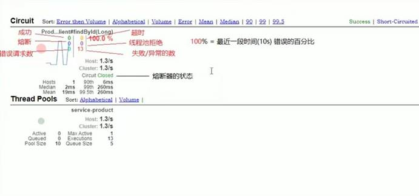
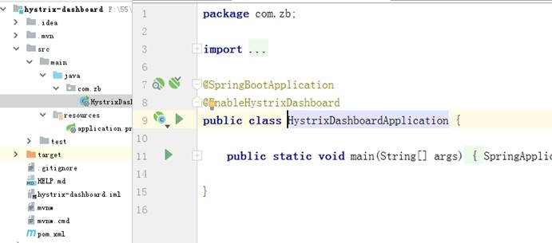
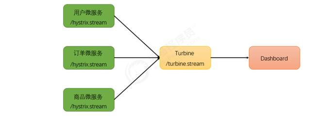
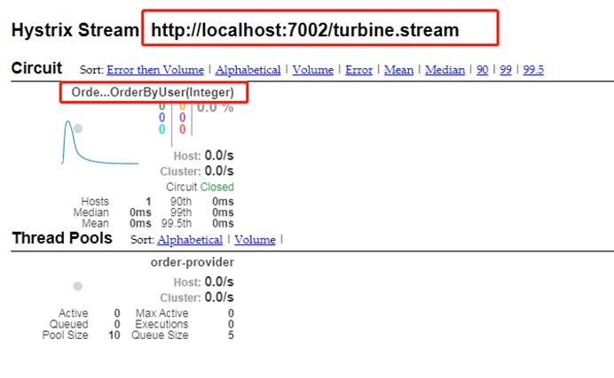
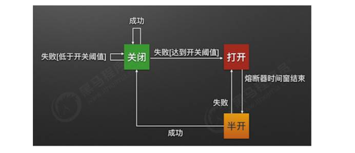
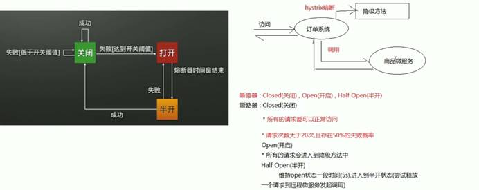
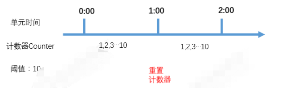
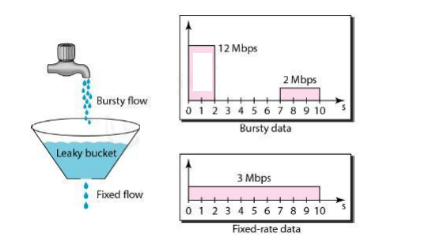
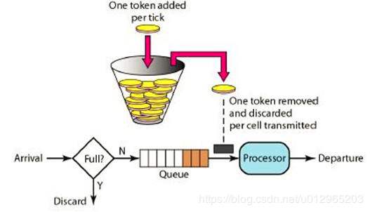

#	一、SpringCloud 

## 1.服务调用Feign(同时启用Hystrix,Ribbon)

### (1) 依赖

```xml
<!--springcloud整合的openFeign-->
        <dependency>
            <groupId>org.springframework.cloud</groupId>
            <artifactId>spring-cloud-starter-openfeign</artifactId>
        </dependency>
```

### (2) yml配置

```yml
#启用fegin的熔断
fegin:
	hystrix:
		enabled: true
#当fegin一个服务名有多个接口时
spring:
    main:
    	allow-bean-definition-overriding: true
#更改fegin内置ribbon的负载均衡
#服务名: +ribbon负载均衡实现类
  ribbon:
    NFLoadBalancerRuleClassName: 	com.netflix.loadbalancer.RandomRule
```

### (3) 启动类

```java
@SpringBootApplication
@EnableFeignClients
public class MyShipment {
    public static void main(String[] args) {
        SpringApplication.run(MyShipment.class,args);
    }
}
```

### (4) 创建feign的通信接口

```java
@FeignClient(value = "contact-server",fallback = MyFeginServiceImpl.class)
//value 指定 从注册中心中调用的服务名 fallback 指定熔断后调用的方法的实现 所在的类
public interface MyFeginService {
    //接口方法 参数 和controller方法对应
    @GetMapping("/findContact")
     List<Contact> findContact(
            @RequestParam(value = "page",required = false,
                    defaultValue = Constant.PAGE_INDEX) Integer page,
            @RequestParam(value = "size",required = false,
                    defaultValue = Constant.PAGE_SIZE) Integer size
            ,@RequestParam(required = false) String key
    );
    @PostMapping("/delContact")
    Map<String,Object> delContact(@RequestBody Integer id);
    @PostMapping("/addContact")
    Map<String,Object> addContact(@RequestBody Contact contact);
}
```

### (5) 创建feign 的熔断实现类

```java
@Component //将实现类加入spring容器
public class MyFeginServiceImpl implements MyFeginService {

    @Override
    public List<Contact> findContact(Integer page, Integer size, String key) {
        return new ArrayList<Contact>(){{
            System.out.println("熔断-fegin-sel");
            this.add(new Contact().setCname("熔断-fegin"));
        }};
    }

    @Override
    public Map<String, Object> delContact(Integer id) {
        System.out.println("熔断-fegin-del");
        return new HashMap<String, Object>(){{
            this.put("result","删除失败!");
        }};
    }

    @Override
    public Map<String, Object> addContact(Contact contact) {
        System.out.println("熔断-fegin-add");
        return new HashMap<String, Object>(){{
            this.put("result","添加失败!");
        }};
    }
}
```

### (6) feign接口的调用

```java
//注入feign接口并调用
@Service
@Transactional(propagation = Propagation.REQUIRED,rollbackFor = Throwable.class)
public class UserServiceImpl implements UserService {
    @Autowired
    private MyFeginService service;

    @Override
    public List<Contact> findContent(String name, Integer pageIndex, Integer pageSize) {
        return service.findContact(pageIndex,pageSize,name);
    }

    @Override
    public Map<String, Object> delContent(Integer id) {
        return service.delContact(id);
    }

    @Override
    public Map<String, Object> addContent(Contact contact) {
        return service.addContact(contact);
    }
}
```

# 二、服务熔断 Hystrix 以及 DashBoard

### (1) 依赖 

```xml
 		<!--心跳检查-->
		<dependency>
            <groupId>org.springframework.boot</groupId>
            <artifactId>spring-boot-starter-actuator</artifactId>
        </dependency>
		<!--hystrix 依赖-->
        <dependency>
            <groupId>org.springframework.cloud</groupId>
            <artifactId>spring-cloud-starter-netflix-hystrix</artifactId>
        </dependency>
		<!--hystrix dashboard监控依赖-->
     	<dependency>
            <groupId>org.springframework.cloud</groupId>
            <artifactId>spring-cloud-starter-netflix-hystrix-dashboard</artifactId>
        </dependency>

```

### (2)yml 配置

```yml
management:
  endpoints:
    web:
      exposure:
        include: health,info, hystrix.stream 
        #坑 consul监康检查 要访问 health,info节点 配置hystrix.stream后actuator默认的暴露节点health,info被覆盖
        #导致 consul节点检查无法通过
```

>### Actuator配置端点
>
>在application.properties中配置端点，
>
>暴露部分端点
>
>management.endpoints.web.exposure.**include**=info,health,beans,env
>
>暴露所有端点
>
>management.endpoints.web.exposure.**include**=*
>
>不暴露beans端点
>
>management.endpoints.web.exposure.**exclude**=beans
>
>在上述配置中，首先使用 management.endpoints.web.exposure.include 暴露所有的端点，接着使用management.endpoints .web.exposure.exclud 排除 en 端点，这样就能够暴露除 env 外的所有 ctuator
>端点了。

**actuator监控(详解见)**

https://www.cnblogs.com/ming-blogs/p/10697033.html

### (3)配置启动类

```java
@SpringBootApplication
@EnableDiscoveryClient 
//@EnableFeignClients //包含 @EnableDiscoveryClient @EnableCircuitBreaker
@EnableCircuitBreaker //短路器
public class MyConsumer {
    public static void main(String[] args) {
        SpringApplication.run(MyConsumer.class,args);
    }
    @LoadBalanced
    @Bean
    public RestTemplate restTemplate(){
        return new RestTemplate();
    }
}

```

### (4)熔断方法以及类的配置

```java
@RestController
//全局配置
@DefaultProperties(defaultFallback = "proc_common")
public class ConsumerController {
    @Autowired
    private RestTemplate template;
    @Autowired
    private UserFeginClient feginClient;
    @PostMapping("/consumer")
    //局部配置
    //@HystrixCommand(fallbackMethod = "proc_rest")
    @HystrixCommand
    public User rest(User user){
        Integer random=(int)(Math.random()*10)+1;
        System.out.println("==============="+random);
        if(random<5)
            throw new RuntimeException("雪崩");
        System.out.println(user);
        String url="http://user-server/rest";
        return template.postForObject(url,user,User.class);
    }
    public User proc_rest(User user){
        return new User(-1,"局部熔断");
    }
    public User proc_common(){
        return new User(-1,"全局熔断");
    }
//    @PostMapping("/consumer")
//    public User rest(User user){
//        System.out.println(user);
//        return feginClient.rest(user);
//    }
}
```

> 除了实现容错功能，Hystrix还提供了近乎实时的监控，HystrixCommand，会生成执行结果和运行指标。比如每秒的请求数量，成功数量等。这些状态会暴露在Actuator提供的/health端点中。只需为项目添加 spring-boot-actuator 依赖，重启项目，访问
>
> http://localhost:9004/actuator/hystrix.stream ,即可看到实时的监控数据

**搭建** **Hystrix DashBoard** **监控** 

刚刚讨论了Hystrix的监控，但访问/hystrix.stream接口获取的都是已文字形式展示的信息。很难通过文 字直观的展示系统的运行状态，所以Hystrix官方还提供了基于图形化的DashBoard（仪表板）监控平台。Hystrix仪表板可以显示每个断路器（被@HystrixCommand注解的方法）的状态


![img](springcloud-2.assets/clip_image002.jpg





# 三、Turbine 断路器聚合监控

**断路器聚合监控** **Turbine** 

在微服务架构体系中，每个服务都需要配置Hystrix DashBoard监控。如果每次只能查看单个实例的监控数据，就需要不断切换监控地址，这显然很不方便。要想看这个系统的Hystrix Dashboard数据就需要用到Hystrix Turbine。Turbine是一个聚合Hystrix 监控数据的工具，他可以将所有相关微服务的Hystrix 监控数据聚合到一起，方便使用。引入Turbine后，整个监控系统架构如下：



```xml
<!--在hystrix基础上新增-->
<dependency> 
<groupId>org.springframework.cloud</groupId> 
<artifactId>spring-cloud-starter-netflix-turbine</artifactId> 
</dependency>
<!--turbine consul 监控依赖-->
		<dependency>
            <groupId>org.springframework.cloud</groupId>
            <artifactId>spring-cloud-starter-netflix-turbine</artifactId>
            <exclusions>
                <exclusion>
                    <groupId>org.springframework.cloud</groupId>
                    <artifactId>spring-cloud-starter-netflix-eureka-client</artifactId>
                </exclusion>
            </exclusions>
        </dependency>
```

```yml
turbine:
  # 要监控的微服务列表，多个用,分隔
  app-config: consumer-server
  # 2.turbine.cluster-name-expression=“default”,表示集群的名字为default
  cluster-name-expression:  "'default'"
```

**参考** https://blog.csdn.net/qincidong/article/details/82752348

> 作为一个独立的监控项目，需要配置启动类，开启HystrixDashboard监控平台，并激活Turbine 
>
>  
>
> 浏览器访问 http://localhost:7002/hystrix 展示HystrixDashboard。并在url位置输入 http://localhost:7002/turbine.stream，动态根据turbine.stream数据展示多个微服务的监控数据



## **熔断器的状态**

熔断器有三个状态 CLOSED 、 OPEN 、 HALF_OPEN 

熔断器默认关闭状态，当触发熔断后状态变更为OPEN ,在等待到指定的时间，Hystrix会放请求检测服务是否开启，这期间熔断器会变为 HALF_OPEN 半启状态，熔断探测服务可用则继续变更为 CLOSED 关闭熔断器。



>Closed：关闭状态（断路器关闭），所有请求都正常访问。代理类维护了最近调用失败的次数，如果某次调用失败，则使失败次数加1。如果最近失败次数超过了在给定时间内允许失败的阈值，则代理类切换到断开(Open)状态。此时代理开启了一个超时时钟，当该时钟超过了该时间，则切换到半断开（Half-Open）状态。该超时时间的设定是给了系统一次机会来修正导致调用失败的错误。 
>
>Open：打开状态（断路器打开），所有请求都会被降级。Hystix会对请求情况计数，当一定时间 内失败请求百分比达到阈值，则触发熔断，断路器会完全关闭。默认失败比例的阈值是50%，请求 次数最少不低于20次。 
>
>Half Open：半开状态，open状态不是永久的，打开后会进入休眠时间（默认是5S）。随后断路 器会自动进入半开状态。此时会释放1次请求通过，若这个请求是健康的，则会关闭断路器，否则 继续保持打开，再次进行5秒休眠计时。 



# 四、常用限流算法

## 1.计数器（Zuul默认的限流方式）

>计数器限流算法是最简单的一种限流实现方式。其本质是通过维护一个单位时间内的计数器，每次请求计数器加1，当单位时间内计数器累加到大于设定的阈值，则之后的请求都被拒绝，直到单位时间已经过去，再将计数器重置为零
>
>#  

## 2.漏桶算法

>​	漏桶算法可以很好地限制容量池的大小，从而防止流量暴增。漏桶可以看作是一个带有常量服务时间的单服务器队列，如果漏桶（包缓存）溢出，那么数据包会被丢弃。 在网络中，漏桶算法可以控制端口的流量输出速率，平滑网络上的突发流量，实现流量整形，从而为网络提供一个稳定的流量。
>
>
>
>为了更好的控制流量，漏桶算法需要通过两个变量进行控制：一个是桶的大小，支持流量突发增多时可以存多少的水（burst），另一个是水桶漏洞的大小（rate）

## 3.令牌桶算法

>​	令牌桶算法是对漏桶算法的一种改进，桶算法能够限制请求调用的速率，而令牌桶算法能够在限制调用 的平均速率的同时还允许一定程度的突发调用。在令牌桶算法中，存在一个桶，用来存放固定数量的令牌。算法中存在一种机制，以一定的速率往桶中放令牌。每次请求调用需要先获取令牌，只有拿到令牌，才有机会继续执行，否则选择选择等待可用的令牌、或者直接拒绝。放令牌这个动作是持续不断的进行，如果桶中令牌数达到上限，就丢弃令牌，所以就存在这种情况，桶中一直有大量的可用令牌，这 时进来的请求就可以直接拿到令牌执行，比如设置qps为100，那么限流器初始化完成一秒后，桶中就已经有100个令牌了，这时服务还没完全启动好，等启动完成对外提供服务时，该限流器可以抵挡瞬时 的100个请求。所以，只有桶中没有令牌时，请求才会进行等待，最后相当于以一定的速率执行。
>
>

# 漏桶算法和令牌桶算法的区别

[漏桶算法](https://www.baidu.com/s?wd=漏桶算法&tn=SE_PcZhidaonwhc_ngpagmjz&rsv_dl=gh_pc_zhidao)与[令牌桶算法](https://www.baidu.com/s?wd=令牌桶算法&tn=SE_PcZhidaonwhc_ngpagmjz&rsv_dl=gh_pc_zhidao)在表面看起来类似，很容易将两者混淆。但事实上，这两者具有截然不同的特性，且为不同的目的而使用。[漏桶算法](https://www.baidu.com/s?wd=漏桶算法&tn=SE_PcZhidaonwhc_ngpagmjz&rsv_dl=gh_pc_zhidao)与[令牌桶算法](https://www.baidu.com/s?wd=令牌桶算法&tn=SE_PcZhidaonwhc_ngpagmjz&rsv_dl=gh_pc_zhidao)的区别在于：l [漏桶算法](https://www.baidu.com/s?wd=漏桶算法&tn=SE_PcZhidaonwhc_ngpagmjz&rsv_dl=gh_pc_zhidao)能够强行限制数据的[传输速率](https://www.baidu.com/s?wd=传输速率&tn=SE_PcZhidaonwhc_ngpagmjz&rsv_dl=gh_pc_zhidao)。l [令牌桶算法](https://www.baidu.com/s?wd=令牌桶算法&tn=SE_PcZhidaonwhc_ngpagmjz&rsv_dl=gh_pc_zhidao)能够在限制数据的平均[传输速率](https://www.baidu.com/s?wd=传输速率&tn=SE_PcZhidaonwhc_ngpagmjz&rsv_dl=gh_pc_zhidao)的同时还允许某种程度的[突发传输](https://www.baidu.com/s?wd=突发传输&tn=SE_PcZhidaonwhc_ngpagmjz&rsv_dl=gh_pc_zhidao)。需要说明的是：在某些情况下，漏桶算法不能够有效地使用网络资源。因为漏桶的漏出速率是固定的，所以即使网络中没有发生拥塞，漏桶算法也不能使某一个单独的数据流达到端口速率。因此，漏桶算法对于存在突发特性的流量来说缺乏效率。而令牌桶算法则能够满足这些具有突发特性的流量。通常，漏桶算法与令牌桶算法结合起来为[网络流量](https://www.baidu.com/s?wd=网络流量&tn=SE_PcZhidaonwhc_ngpagmjz&rsv_dl=gh_pc_zhidao)提供更高效的控制。

[](https://gss0.baidu.com/9fo3dSag_xI4khGko9WTAnF6hhy/zhidao/pic/item/30adcbef76094b365ece5235a4cc7cd98c109d8e.jpg)

 

# 一、问题描述  

　　某天A君突然发现自己的接口请求量突然涨到之前的10倍，没多久该接口几乎不可使用，并引发连锁反应导致整个系统崩溃。如何应对这种情况呢？生活给了我们答案：比如老式电闸都安装了保险丝，一旦有人使用超大功率的设备，保险丝就会烧断以保护各个电器不被强电流给烧坏。同理我们的接口也需要安装上“保险丝”，以防止非预期的请求对系统压力过大而引起的系统瘫痪，当流量过大时，可以采取拒绝或者引流等机制。 

# 二、常用的限流算法

   常用的限流算法有两种：漏桶算法和令牌桶算法。

   漏桶算法思路很简单，水（请求）先进入到漏桶里，漏桶以一定的速度出水，当水流入速度过大会直接溢出，可以看出漏桶算法能强行限制数据的传输速率。


图1 漏桶算法示意图

   对于很多应用场景来说，除了要求能够限制数据的平均传输速率外，还要求允许某种程度的突发传输。这时候漏桶算法可能就不合适了，令牌桶算法更为适合。如图2所示，令牌桶算法的原理是系统会以一个恒定的速度往桶里放入令牌，而如果请求需要被处理，则需要先从桶里获取一个令牌，当桶里没有令牌可取时，则拒绝服务。


图2 令牌桶算法示意图

 

并不能说明令牌桶一定比漏洞好，她们使用场景不一样。令牌桶可以用来保护自己，主要用来对调用者频率进行限流，为的是让自己不被打垮。所以如果自己本身有处理能力的时候，如果流量突发（实际消费能力强于配置的流量限制），那么实际处理速率可以超过配置的限制。而漏桶算法，这是用来保护他人，也就是保护他所调用的系统。主要场景是，当调用的第三方系统本身没有保护机制，或者有流量限制的时候，我们的调用速度不能超过他的限制，由于我们不能更改第三方系统，所以只有在主调方控制。这个时候，即使流量突发，也必须舍弃。因为消费能力是第三方决定的。
总结起来：如果要让自己的系统不被打垮，用令牌桶。如果保证被别人的系统不被打垮，用漏桶算法。