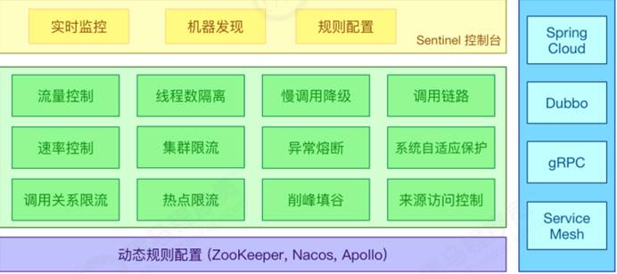
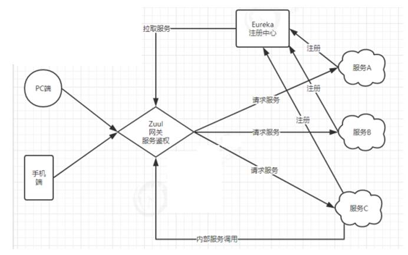
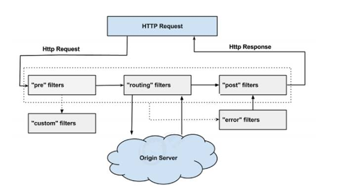

# 一、Spring Cloud

## 1、Alibaba Sentinel


Sentinel 的主要特性：



**名词解释**

Sentinel 可以简单的分为 Sentinel 核心库和 Dashboard。核心库不依赖 Dashboard，但是结合Dashboard 可以取得最好的效果。

使用 Sentinel 来进行熔断保护，主要分为几个步骤:

1. 定义资源 

2. 定义规则 

3. 检验规则是否生效

资源：可以是任何东西，一个服务，服务里的方法，甚至是一段代码。

规则：Sentinel 支持以下几种规则：流量控制规则、熔断降级规则、系统保护规则、来源访问控制规则和 热点参数规则。Sentinel 的所有规则都可以在内存态中动态地查询及修改，修改之后立即生效先把可能需要保护的资源定义好，之后再配置规则。也可以理解为，只要有了资源，我们就可以在任何时候灵活地定义各种流量控制规则。在编码的时候，只需要考虑这个代码是否需要保护，如果需要保护，就将之定义为一个资源。

>**Sentinel **中的管理控制台
>
>**获取** **Sentinel** **控制台** 
>
>您可以从官方网站中下载最新版本的控制台 jar 包，下载地址如下
>
> https://github.com/alibaba/Sentinel/releases/download/1.6.3/sentinel-dashboard-1.6.3.jar
>
>使用如下命令启动控制台： 
>
> java -Dserver.port=10000  -Dcsp.sentinel.dashboard.server=localhost:10000 -Dproject.name=sentinel-dashboard  -jar      sentinel-dashboard-1.6.3.jar  
>
>其中 -Dserver.port=10000 用于指定 Sentinel 控制台端口为 10000 。 
>
>从 Sentinel 1.6.0 起，Sentinel 控制台引入基本的登录功能，默认用户名和密码都是 sentinel 。可以参考 鉴权模块文档 配置用户名和密码。
>
>启动 Sentinel 控制台需要 JDK 版本为 1.8 及以上版本。

### (1) 依赖

``` xml
<dependency>
    <groupId>com.alibaba.cloud</groupId>
    <artifactId>spring-cloud-starter-alibaba-sentinel</artifactId>
</dependency>
<!-- 父项目dependencyManagement 导入 spring-cloud-alibaba-dependencies -->
<dependency>
    <groupId>com.alibaba.cloud</groupId>
    <artifactId>spring-cloud-alibaba-dependencies</artifactId>
    <version>1.5.0.RELEASE</version>
    <type>pom</type>
    <scope>import</scope>
</dependency>
```

### (2)  yml配置

```yaml
spring:
  application:
    name: user-consumer
  cloud:
    sentinel:
      transport:
        dashboard: http://localhost:10000
```

### (3) 代码配置

```java
@SentinelResource(fallback = "sentinelFallBack",blockHandler = "sentinelBlockHandler")
    @RequestMapping("/find3/{id}")
    public List<Boy> findBoys3(@PathVariable Integer id){
        System.out.println(id);
        if(id==1)
            throw new RuntimeException("sentinel熔断---");
        return restTemplate.postForObject("http://boy-server/boy?id="+id,null,List.class);
    }
    public List<Boy> sentinelFallBack(Integer id){
        return new ArrayList<Boy>(){{
            this.add(new Boy(2,"sentinelFallBack",100));
        }};
    } 
	// BlockException 一定要加
    public List<Boy> sentinelBlockHandler(Integer id,
                                         BlockException e一定要加){
        return new ArrayList<Boy>(){{
            this.add(new Boy(2,"sentinelBlockHandler",100));
        }};
}
```

## **2、Spring网关**

### 2.1 Zuul网关

**Zuul简介**

ZUUL是Netflflix开源的微服务网关，它可以和Eureka、Ribbon、Hystrix等组件配合使用，Zuul组件的核心是一系列的过滤器，这些过滤器可以完成以下功能： 

动态路由：动态将请求路由到不同后端集群 

压力测试：逐渐增加指向集群的流量，以了解性能 

负载分配：为每一种负载类型分配对应容量，并弃用超出限定值的请求 

静态响应处理：边缘位置进行响应，避免转发到内部集群 

身份认证和安全: 识别每一个资源的验证要求，并拒绝那些不符的请求。Spring Cloud对Zuul进行了整合和增强。

### (1) 依赖

```xml
<dependencies>
    <!-- eureka客户端 可以更换为 consul 客户端 -->
    <dependency>
        <groupId>org.springframework.cloud</groupId>
        <artifactId>spring-cloud-starter-netflix-eureka-client</artifactId>
    </dependency>
   <!--
		<dependency>
    		<groupId>org.springframework.cloud</groupId>
    		<artifactId>spring-cloud-starter-consul-discovery</artifactId>
		</dependency>
	--> 
    
<!--actuator用于心跳检查  consul不加 心跳检查过不了-->
<dependency>
    <groupId>org.springframework.boot</groupId>
    <artifactId>spring-boot-starter-actuator</artifactId>
</dependency>
    <dependency>
        <groupId>org.springframework.cloud</groupId>
        <artifactId>spring-cloud-starter-netflix-zuul</artifactId>
        <version>2.1.0.RELEASE</version>
    </dependency>
    <!-- zuul限流 -->
<dependency>
    <groupId>com.marcosbarbero.cloud</groupId>
    <artifactId>spring-cloud-zuul-ratelimit</artifactId>
    <version>1.3.4.RELEASE</version>
</dependency>
</dependencies>
```

### (2)配置

```yaml
logging:
  level:
    root: info
#zuul 配置网关跨域
zuul: #将网关层的CORS放开 需要忽略的头部信息，不在传播到其他服务
  sensitiveHeaders: Cookie,Set-Cookie
  ignored-headers: Access-Control-Allow-Credentials, Access-Control-Allow-Origin, Access-Control-Allow-Methods
  routes:
 	 #这里是路由id，随意写
    consumer-server:
     #映射地址
      path: /**
      # 转发到哪个服务
      serviceId: consumer-server
  ratelimit:
  enabled: true #开启限流
  default-policy:
      limit: 3 #60s 内请求超过 3 次，服务端就抛出异常，60s 后可以恢复正常请求
      refresh-interval: 60
      type: origin #针对 IP 进行限流，不影响其他 IP
```

### (3) 代码配置

```java
@SpringBootApplication
@EnableZuulProxy
public class MyZuul {
    public static void main(String[] args) {
        SpringApplication.run(MyZuul.class,args);
    }
    //跨域配置  
    @Bean
    public CorsFilter corsFilter() {
        final UrlBasedCorsConfigurationSource source = new UrlBasedCorsConfigurationSource();
        final CorsConfiguration corsConfiguration = new CorsConfiguration();
        corsConfiguration.addAllowedHeader("*");
        corsConfiguration.addAllowedOrigin("*");
        corsConfiguration.addAllowedMethod("*");
        source.registerCorsConfiguration("/**", corsConfiguration);
        return new CorsFilter(source);
    }
}
```

​																					[**Zuul跨域配置详解**](https://blog.csdn.net/moshowgame/article/details/80507696) 



### (4) Zuul 中的过滤器

通过之前的学习，我们得知Zuul它包含了两个核心功能：对请求的路由和过滤。其中路由功能负责将外部请求转发到具体的微服务实例上，是实现外部访问统一入口的基础；而过滤器功能则负责对请求的处理过程进行干预，是实现请求校验、服务聚合等功能的基础。其实，路由功能在真正运行时，它的路由映射和请求转发同样也由几个不同的过滤器完成的。所以，过滤器可以说是Zuul实现API网关功能最为核心的部件，每一个进入Zuul的HTTP请求都会经过一系列的过滤器处理链得到请求响应并返回给客户端。

那么接下来，我们重点学习的就是Zuul的第二个核心功能：过滤器。 

**ZuulFilter 简介**

以通过配置 urlPatterns 来拦截对应的请求。而 Zuul 中的过滤器总共有 4 种类型，且每种类型都有对应的使用场景。 

1. PRE：**(before增强)**这种过滤器在请求被路由之前调用。我们可利用这种过滤器实现身份验证、在集群中选择请求的微服务、记录调试信息等。

2. ROUTING：**(around增强)**这种过滤器将请求路由到微服务。这种过滤器用于构建发送给微服务的请求，并使用Apache HttpClient或Netfifilx Ribbon请求微服务。 

3. POST：**(afterReturnning 或after增强)**这种过滤器在路由到微服务以后执行。这种过滤器可用来为响应添加标准的HTTP 

Header、收集统计信息和指标、将响应从微服务发送给客户端等。 

4. ERROR：**(afterThrowing增强)**在其他阶段发生错误时执行该过滤器。

>
>
>正常流程：
>
>请求到达首先会经过pre类型过滤器，而后到达routing类型，进行路由，请求就到达     真正的服务提供者，执行请求，返回结果后，会到达post过滤器。而后返回响应。 
>
>异常流程：
>
>整个过程中，pre或者routing过滤器出现异常，都会直接进入error过滤器，再error     处理完毕后，会将请求交给POST过滤器，最后返回给用户。 
>
>如果是error过滤器自己出现异常，最终也会进入POST过滤器，而后返回。 
>
>如果是POST过滤器出现异常，会跳转到error过滤器，但是与pre和routing不同的时，     请求不会再到达POST过滤器了。 
>
>不同过滤器的场景：
>
>请求鉴权：一般放在pre类型，如果发现没有访问权限，直接就拦截了
>
>异常处理：一般会在error类型和post类型过滤器中结合来处理。 
>
>服务调用时长统计：pre和post结合使用

**类似于 SpringAop 中的通知** 

#### 自定义过滤器:

```java
@Component
public class PowerFilter extends ZuulFilter {
    @Override
    //过滤器类型
    public String filterType() {
        return FilterConstants.PRE_TYPE;
    }

    @Override
    //过滤执行优限度 越小越先执行
    //1  按照filterType决定顺序
    //Pre 优先 Post执行，此时filterOrder没有作用。
    //2 filterType相同
    //filterOrder有作用，数字越小，越先执行。（负数也是这个规则，0和-1的话，-1先执行）
    //3 相同filterType,相同filterOrder，都执行，执行顺序不清楚。
    public int filterOrder() {
        return 0;
    }

    @Override
    public boolean shouldFilter() {
        return true;
    }

    @Override
    public Object run() {
        RequestContext currentContext = RequestContext.getCurrentContext();
        HttpServletRequest request = currentContext.getRequest();
        String token = request.getParameter("token");
        if(token==null || token.equals("")){
            currentContext.setSendZuulResponse(false);
            currentContext.setResponseStatusCode(401);
            //字符集编码
            context.getResponse().setContentType("application/json;charset=utf-8");
            context.setResponseBody("{\"msg\":\"401 account 徐立\"}");
            return "access";
        }
        return "next";
    }
}

```

#### 异常处理: 用于处理error异常

```java
package cn.cloud.controller;

import org.springframework.boot.web.servlet.error.ErrorController;
import org.springframework.web.bind.annotation.RequestMapping;
import org.springframework.web.bind.annotation.RestController;

/**
 * <功能描述>
 *
 * @author xuli1294844209@qq.com
 * @createTime 2020/9/22
 **/
@RestController
public class ZuulErrorController implements ErrorController {
    @Override
    public String getErrorPath() {
        return "/error";
    }
    @RequestMapping("/error")
    public String error(){
        return "{\"result\":\"访问太多频繁，请稍后再访问！！！\"}";
    }
}
```

#### 令牌桶限流

```java
package cn.cloud.filter;

import com.google.common.util.concurrent.RateLimiter;
import com.netflix.zuul.ZuulFilter;
import com.netflix.zuul.context.RequestContext;
import com.netflix.zuul.exception.ZuulException;
import org.springframework.cloud.netflix.zuul.filters.support.FilterConstants;
import org.springframework.stereotype.Component;

import javax.servlet.http.HttpServletRequest;

/**
 * <功能描述>
 *
 * @author xuli1294844209@qq.com
 * @createTime 2020/9/22
 **/
@Component
public class MyRateLimitFilter extends ZuulFilter {
    private static final RateLimiter RATE_LIMITER=RateLimiter.create(2);
    @Override
    public String filterType() {
        return FilterConstants.PRE_TYPE;
    }

    @Override
    public int filterOrder() {
        return -5;
    }

    @Override
    public boolean shouldFilter() {
        RequestContext context = RequestContext.getCurrentContext();
        HttpServletRequest request = context.getRequest();
        if(!RATE_LIMITER.tryAcquire()){
            context.setSendZuulResponse(false);
            context.setResponseStatusCode(401);
            //context.getResponse().setCharacterEncoding("utf-8");
            context.getResponse().setContentType("application/json;charset=utf-8");
            context.setResponseBody("{\"msg\":\"401 account without 你被限流了\"}");
            return false;
        }
        return true;
    }

    @Override
    public Object run() throws ZuulException {
        return null;
    }
}
```

