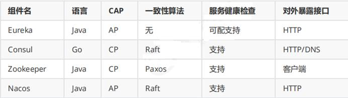
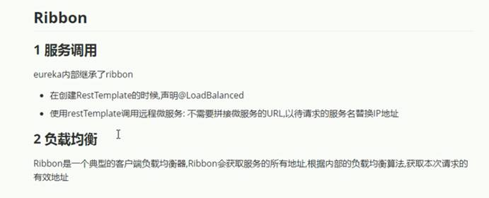
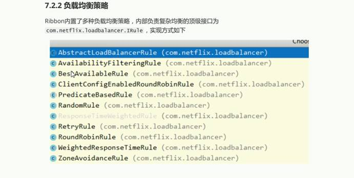
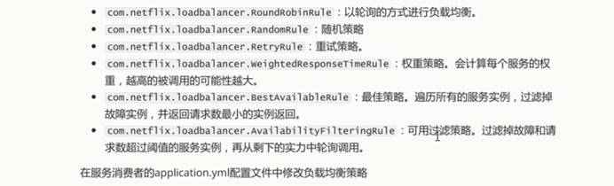
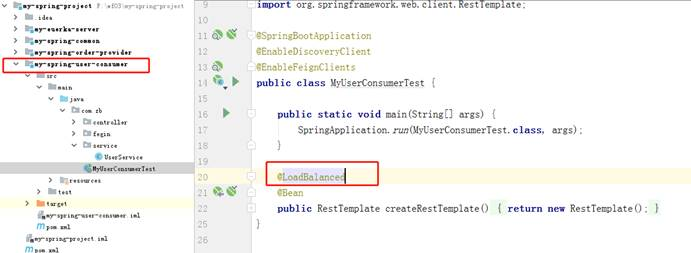
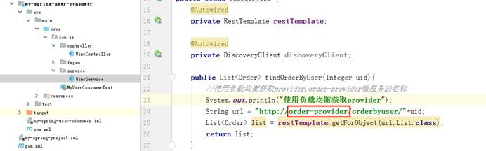

`前言`

## SpringBoot和SpringCloud的区别

SpringBoot专注于快速方便的**开发单个个体微服务**。

SpringCloud是关注全局的微服务协调整理治理框架，它将SpringBoot开发的一个个单体微服务整合并管理起来，

为各个微服务之间提供，配置管理、服务发现、断路器、路由、微代理、事件总线、全局锁、决策竞选、分布式会话等等集成服务

SpringBoot可以离开SpringCloud独立使用开发项目，但是 **SpringCloud离不开SpringBoot**，属于依赖的关系.

SpringBoot专注于**快速、方便的开发单个微服务个体**，SpringCloud关注**全局的服务治理框架**。

#	一、微服务注册中心

>注册中心可以说是微服务架构中的”通讯录“，它记录了服务和服务地址的映射关系在分布式架构中， 
>
>服务会注册到这里，当服务需要调用其它服务时，就这里找到服务的地址，进行调用。
>
>服务注册中心（下称注册中心）是微服务架构非常重要的一个组件，在微服务架构里主要起到了协调者的一个作用。注册中心一般包含如下几个功能：
>
>1. 服务发现： 
>
>服务注册/反注册：保存服务提供者和服务调用者的信息 
>
>服务订阅/取消订阅：服务调用者订阅服务提供者的信息，最好有实时推送的功能 
>
>服务路由（可选）：具有筛选整合服务提供者的能力。
>
>2. 服务配置： 
>
>配置订阅：服务提供者和服务调用者订阅微服务相关的配置
>
>配置下发：主动将配置推送给服务提供者和服务调用者
>
>3. 服务健康检测 
>
>检测服务提供者的健康情况
>
>CAP [一致性](https://baike.baidu.com/item/一致性/9840083)（Consistency）、[可用性](https://baike.baidu.com/item/可用性/109628)（Availability）、分区容错性（Partition tolerance）



##	1、 Netflix Eureka

`servlet 程序`

###	(1).依赖

```xml
<!--父pom 加入SpringCloud 依赖-->
<dependencyManagement>
    <dependencies>
        <dependency>
            <groupId>org.springframework.cloud</groupId>
            <artifactId>spring-cloud-dependencies</artifactId>
            <version>Greenwich.RELEASE</version>
            <type>pom</type>
            <scope>import</scope>
        </dependency>
    </dependencies>
</dependencyManagement>
<repositories>
    <repository>
        <id>spring-milestones</id>
        <name>Spring Milestones</name>
        <url>https://repo.spring.io/milestone</url>
        <snapshots>
            <enabled>false</enabled>
        </snapshots>
    </repository>
</repositories>

<!--Eureka 服务端 依赖-->
<dependency>
            <groupId>org.springframework.cloud</groupId>
            <artifactId>spring-cloud-starter-netflix-eureka-server</artifactId>
        </dependency>
<!--Eureka 客户端 依赖-->
<dependency>
            <groupId>org.springframework.cloud</groupId>
            <artifactId>spring-cloud-starter-netflix-eureka-client</artifactId>
        </dependency>
```

###		(2) yml配置

```yml
server:
 port: 端口号
spring:
 application:
  name: 服务名
  #服务端
 security:
  user:
  	name: 用户名
  	password: 密码
eureka:
 client:
  service-url:
   defaultZone: 注册到的地址
  #不提取注册表
  fetch-register: false
  #不注册到自身
  register-with-eureka: false
 server:
   enable-self-preservation: false #禁用自我保护功能
   eviction-interval-timer-in-ms: 4000 #剔除时间
  #客户端
eureka:
 client:
  service-url:
   defaultZone: 注册到的地址
 instance:
   instance-id: 实例-id
   prefer-ip-adress: true #使用ip地址注册
   lease-renewal-interval-in-second:  #租约续约间隔（以秒为单位）
   lease-expiration-duration-in-senconds:  #合约过期时间（以秒为单位）
```

### (3) 启动类注解

``` java
//服务端
@SpringBootApplication
@EnableEurekaServer
@EnableWebSecurity 
//,1: 加载了WebSecurityConfiguration配置类, 配置安全认证策略。
//2: 加载了AuthenticationConfiguration, 配置了认证信息。
public class MyEureka {
    public static void main(String[] args) {
        SpringApplication.run(MyEureka.class,args);
    }
     @Override
    protected void configure(HttpSecurity http) throws Exception {
        http.csrf().disable();//关闭csrf检查
        super.configure(http);
    }
}
//客户端
@SpringBootApplication
@EnableEurekaClient
public class MyOrder {
    public static void main(String[] args) {
        SpringApplication.run(MyOrder.class,args);
    }
}
```

## 2.Consul

### (1) 依赖

```xml
<!--父pom 加入SpringCloud 依赖-->
<dependencyManagement>
    <dependencies>
        <dependency>
            <groupId>org.springframework.cloud</groupId>
            <artifactId>spring-cloud-dependencies</artifactId>
            <version>Greenwich.RELEASE</version>
            <type>pom</type>
            <scope>import</scope>
        </dependency>
    </dependencies>
</dependencyManagement>
<repositories>
    <repository>
        <id>spring-milestones</id>
        <name>Spring Milestones</name>
        <url>https://repo.spring.io/milestone</url>
        <snapshots>
            <enabled>false</enabled>
        </snapshots>
    </repository>
</repositories>

<!--Consu	 服务端 依赖-->
<!--服务端需要下载 开启 consul agent -dev -client=0.0.0.0 -->
<!--Consu 客户端 依赖-->
<!--SpringCloud提供的基于Consul的服务发现-->
<!--通过postman发送put请求到http://127.0.0.1:8500/v1/catalog/register地址可以完成服务注册-->
<dependency>
    <groupId>org.springframework.cloud</groupId>
    <artifactId>spring-cloud-starter-consul-discovery</artifactId>
</dependency>
<!--actuator用于心跳检查-->
<dependency>
    <groupId>org.springframework.boot</groupId>
    <artifactId>spring-boot-starter-actuator</artifactId>
</dependency>

```

### (2) yml配置

```yml
server:
  port: 端口号
spring:
  application:
 	name: 服务
  cloud:
   	consul:
   		host: 127.0.0.1
   		port: 8500
   		discovery:
   			register: true
   			instance-id: ${spring.application.name}-${server.port}
   			service-name: ${spring.application.name}
   			port: ${server.port}
   			prefer-ip-address: true
   			ip-address: ${spring.cloud.client.ip-address}
```

### (3)启动类配置

```java
//客户端
@SpringBootApplication
@EnableDiscoveryClient
public class MyOrder {
    public static void main(String[] args) {
        SpringApplication.run(MyOrder.class,args);
    }
}
```

> Ribbon
>
> ​	consul 内部也继承了Ribbon
>
> 
>
> 
>
> 

```java
客户端调用服务端的三种实现方式
//第一种实现是不需要任何注册中心
@Override
 public List<Order> currentUserOrderInfo(Integer uid) {
     String url = "http://localhost:8001/findOrderByUid/" + uid;
     //http请求调用远程方法
     List<Order> list = restTemplate.getForObject(url, List.class);
     return list;
 }


//第二种方式在启动类上添加@EnableDiscoveryClient
 @Override
 public List<Order> currentUserOrderInfo(Integer uid) {
     System.out.println("discoveryClient调用");
     List<ServiceInstance> instances = discoveryClient.getInstances("order-server-provider");
     ServiceInstance serviceInstance = instances.get(0);
     String url = "http://" + serviceInstance.getHost() + ":" + serviceInstance.getPort() + "/findOrderByUid/" + uid;
     System.out.println(url);
     //http请求调用远程方法
     List<Order> list = restTemplate.getForObject(url, List.class);
     return list;
 }

 @Override
 public List<Order> currentUserOrderInfo(Integer uid) {
//这种方式采用ribbon的负载均衡使用时，必须要求在RestTemplate上添加@LoadBalanced
     String url = "http://order-server-provider/findOrderByUid/" + uid;
     //http请求调用远程方法
     List<Order> list = restTemplate.getForObject(url, List.class);
     return list;
 }

```





```yml
order-provider: #服务名
  ribbon:
    NFLoadBalancerRuleClassName: 	com.netflix.loadbalancer.RandomRule

```

