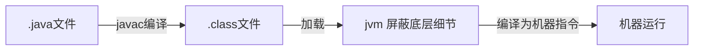

# 						第三轮 反转课堂									

​																	`演讲人:徐立`

## 回顾: 

#### 	1.JDK,JRE,JVM 间关系

	>JDK：(Java Development Kit) 的简称，Java 开发工具包，提供了 Java 的开发环境和运行环境。
	>
	>JRE：(Java Runtime Environment) 的简称，Java 运行环境，为 Java 的运行提供了所需环境。
	>
	>具体来说 JDK 其实包含了 JRE，同时还包含了编译 Java 源码的编译器 Javac，还包含了很多 Java 程序调试和分析的工具。简单来说：如果你需要运行 Java 程序，只需安装 JRE 就可以了，如果你需要编写 Java 程序，需要安装 JDK。

#### 	2.JVM如何做到跨平台

## 一、JVM 内存模型

#### jdk1.8 之前

 

这是jdk1.8之前的内存模型，其中方法区和堆是是线程共享的，但是**在jdk1.8之后**
**元数据区取代了永久代**。元空间的本质和永久代类似，都是对JVM规范中方法区的实现。不过元空间与永久代之间最大的区别在于：元数据空间并不在虚拟机中，而是使用本地内存

#### jdk1.8

>Java 虚拟机在执行 Java 程序的过程中会把他所管理的内存划分为若干个不同的数据区域。Java 虚拟机规范将 JVM 所管理的内存分为以下几个运行时数据区：程序计数器、Java 虚拟机栈、本地方法栈、Java 堆、元数据区。
>
>JDK8 之前，Hotspot 中方法区的实现是永久代（Perm），JDK8 开始使用元空间（Metaspace），以前永久代所有内容的字符串常量移至堆内存，其他内容移至元空间，元空间直接在本地内存分配。
>
>为什么要使用元空间取代永久代的实现？
>
>1.  字符串存在永久代中，容易出现性能问题和内存溢出。
>
>2.  类及方法的信息等比较难确定其大小，因此对于永久代的大小指定比较困难，太小容易出现永久代溢出，太大则容易导致老年代溢出。
>
>3.  永久代会为 GC 带来不必要的复杂度，并且回收效率偏低。
>
>4.  将 HotSpot 与 JRockit 合二为一

##### 1.程序计数器(线程私有) 

​	一块较小的内存空间, 是当前线程所执行的字节码的行号指示器，每条线程都要有一个独立的 程序计数器，这类内存也称为“线程私有”的内存。 正在执行 java 方法的话，计数器记录的是虚拟机字节码指令的地址（当前指令的地址）。如 果还是 Native 方法，则为空。 这个内存区域是唯一一个在虚拟机中没有规定任何 OOM 情况的区域。

##### 2.虚拟机栈(线程私有) 

​	是描述java方法执行的内存模型，每个方法在执行的同时都会创建一个栈帧（Stack Frame） 用于存储局部变量表、操作数栈、动态链接、方法出口等信息。每一个方法从调用直至执行完成 的过程，就对应着一个栈帧在虚拟机栈中入栈到出栈的过程。 栈帧（ Frame）是用来存储数据和部分过程结果的数据结构，同时也被用来处理动态链接 (Dynamic Linking)、 方法返回值和异常分派（ Dispatch Exception）。

​	**栈帧随着方法调用而创建，随着方法结束而销毁——无论方法是正常完成还是异常完成（抛出了在方法内未被捕获的异 常）都算作方法结束。**

##### 3.本地方法区(线程私有)

​	 本地方法区和 Java Stack 作用类似, 区别是虚拟机栈为执行 Java 方法服务, 而本地方法栈则为 Native 方法服务, 如果一个 VM 实现使用 C-linkage 模型来支持 Native 调用, 那么该栈将会是一个 C 栈，但 HotSpot VM 直接就把本地方法栈和虚拟机栈合二为一。

##### 4.堆（Heap-线程共享）

-运行时数据区 是被线程共享的一块内存区域，创建的对象和数组都保存在 Java 堆内存中，也是垃圾收集器进行 垃圾收集的最重要的内存区域。由于现代 VM 采用分代收集算法, 因此 Java 堆从 GC 的角度还可以 细分为: 新生代(Eden 区、From Survivor 区和 To Survivor 区)和老年代。

#####  5.方法区/永久代（线程共享） 

即我们常说的永久代(Permanent Generation), 用于存储被 JVM 加载的类信息、常量、静 态变量、即时编译器编译后的代码等数据. HotSpot VM把GC分代收集扩展至方法区, 即使用Java 堆的永久代来实现方法区, 这样 HotSpot 的垃圾收集器就可以像管理 Java 堆一样管理这部分内存, 而不必为方法区开发专门的内存管理器(永久带的内存回收的主要目标是针对常量池的回收和类型 的卸载, 因此收益一般很小)。 

##### 运行时常量池（Runtime Constant Pool）

是方法区的一部分。Class 文件中除了有类的版 本、字段、方法、接口等描述等信息外，还有一项信息是常量池 13/04/2018 Page 24 of 283 （Constant Pool Table），用于存放编译期生成的各种字面量和符号引用，这部分内容将在类加 载后存放到方法区的运行时常量池中。 Java 虚拟机对 Class 文件的每一部分（自然也包括常量 池）的格式都有严格的规定，每一个字节用于存储哪种数据都必须符合规范上的要求，这样才会 被虚拟机认可、装载和执行。

6.JAVA8 与元数据 在 Java8 中，永久代已经被移除，被一个称为“元数据区”（元空间）的区域所取代。元空间 的本质和永久代类似，元空间与永久代之间最大的区别在于：元空间并不在虚拟机中，而是使用 本地内存。因此，默认情况下，元空间的大小仅受本地内存限制。类的元数据放入 native memory, 字符串池和类的静态变量放入 java 堆中，这样可以加载多少类的元数据就不再由 MaxPermSize 控制, 而由系统的实际可用空间来控制。

# 二、NIO BIO AIO

### 同步 异步 阻塞 非阻塞

- 同步，一个任务的完成之前不能做其他操作，必须等待（等于在打电话）

- 异步，一个任务的完成之前，可以进行其他操作（等于在聊QQ）

- 阻塞，是相对于CPU来说的， 挂起当前线程，不能做其他操作只能等待

- 非阻塞,，无须挂起当前线程，可以去执行其他操作

- **同步阻塞**：小明一直盯着下载进度条，到 100% 的时候就完成。 - 同步体现在：等待下载完成通知。 - 阻塞体现在：等待下载完成通知过程中，不能做其他任务处理。

  **同步非阻塞**：小明提交下载任务后就去干别的，每过一段时间就去瞄一眼进度条，看到 100% 就完成。 - 同步体现在：等待下载完成通知。 - 非阻塞体现在：等待下载完成通知过程中，去干别的任务了，只是时不时会瞄一眼进度条。【小明必须要在两个任务间切换，关注下载进度】

  **异步阻塞**：小明换了个有下载完成通知功能的软件，下载完成就“叮”一声。不过小明不做别的事，仍然一直等待“叮”的声音。 - 异步体现在：下载完成“叮”一声通知。 - 阻塞体现在：等待下载完成“叮”一声通知过程中，不能做其他任务处理。

  **异步非阻塞**：仍然是那个会“叮”一声的下载软件，小明提交下载任务后就去干别的，听到“叮”的一声就知道完成了。 - 异步体现在：下载完成“叮”一声通知。 - 非阻塞体现在：等待下载完成“叮”一声通知过程中，去干别的任务了，只需要接收“叮”声通知即可。【软件处理下载任务，小明处理其他任务，不需关注进度，只需接收软件“叮”声通知，即可】

#### 什么是BIO

- BIO：同步并阻塞，服务器实现一个连接一个线程，即客户端有连接请求时服务器端就需要启动一个线程进行处理，没处理完之前此线程不能做其他操作（如果是单线程的情况下，我传输的文件很大呢？），当然可以通过线程池机制改善。BIO方式适用于连接数目比较小且固定的架构，这种方式对服务器资源要求比较高，并发局限于应用中，JDK1.4以前的唯一选择，但程序直观简单易理解。

#### 什么是NIO

- NIO:同步非阻塞，服务器实现一个连接一个线程，即客户端发送的连接请求都会注册到多路复用器上，多路复用器轮询到连接有I/O请求时才启动一个线程进行处理。NIO方式适用于连接数目多且连接比较短（轻操作）的架构，比如聊天服务器，并发局限于应用中，编程比较复杂，JDK1.4之后开始支持。

#### 什么是AIO

- AIO：异步非阻塞，服务器实现模式为一个有效请求一个线程，客户端的I/O请求都是由操作系统先完成了再通知服务器应用去启动线程进行处理，AIO方式使用于连接数目多且连接比较长（重操作）的架构，比如相册服务器，充分调用操作系统参与并发操作，编程比较复杂，JDK1.7之后开始支持。

